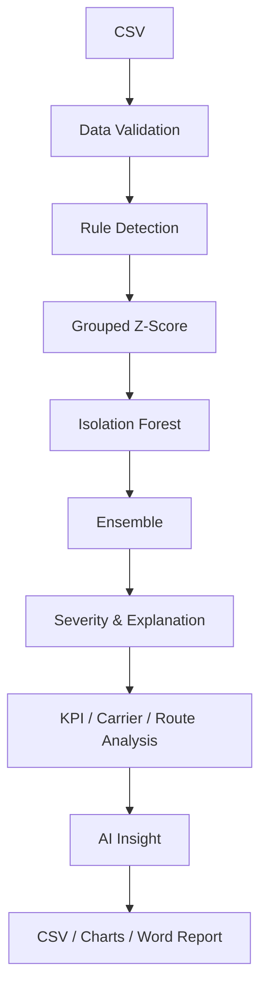

# Shipping Anomaly Detection

一个面向航运与物流运输订单的可解释异常检测平台：从 CSV 数据校验到三层检测、业务 KPI、自动洞察与 Word 报告，全流程真实运行。

## Background

运输订单中的异常并不只等于“延误天数很大”。实际分析还需要回答：数据是否可信、异常相对于哪条路线、多个方法是否一致、承运商样本量是否足够，以及业务人员为什么应该关注某一票订单。

本项目围绕这条真实业务链路构建：

- 校验并清洗用户上传的运输订单；
- 同时运行业务规则、路线分组 Z-Score 和 Isolation Forest；
- 输出逐条异常方法、风险分数、严重等级和中文原因；
- 汇总承运商与路线表现，并显式展示样本量；
- 生成可下载的 CSV、PNG 图表和 Word 分析报告。

## Features

- **可靠数据接入**：支持 UTF-8、UTF-8-SIG、GBK/GB18030 CSV，处理空文件、缺字段、混合日期、NaN、inf、负货重/运费、重复订单和错误日期顺序。
- **三层独立检测**：业务规则、按路线分组的 leave-one-out Z-Score、固定随机种子的 Isolation Forest。
- **参数真实生效**：Z-Score threshold 与 Isolation Forest contamination 均通过经过校验的配置对象传入算法。
- **可解释结果**：每条记录输出 `anomaly_methods`、`anomaly_score`、`severity` 和 `reason`。
- **业务分析**：总订单、异常数、异常率、平均延误、严重异常、承运商绩效与高风险路线均从当前数据实时计算。
- **样本量意识**：承运商和路线同时展示订单量、异常数、原始异常率及调整后异常率，降低小样本误导。
- **稳定交互**：分析结果保存在 `st.session_state`；筛选、切换图表、生成洞察和下载文件不会重新训练模型或丢失结果。
- **双模式洞察**：默认使用不依赖 API 的本地自动业务摘要；可选 DeepSeek API，失败时自动安全回退。
- **多格式导出**：完整检测 CSV、筛选异常 CSV、PNG 图表和包含洞察的 Word 报告。
- **可选吞吐量背景**：港口吞吐量 CSV 仅补充运营分析，不参与核心异常检测或模型投票。

## Analysis Pipeline



## Tech Stack

- Python 3.10–3.14（本地与云端推荐 3.13）
- Streamlit
- Pandas / NumPy
- Scikit-learn
- Matplotlib
- python-docx
- pytest
- DeepSeek Chat Completions API（可选，标准库 `urllib` 调用）

## Demo

公网演示：[https://shipping-anomaly-v7-anson.streamlit.app/](https://shipping-anomaly-v7-anson.streamlit.app/)

> 页面默认使用明确标注的模拟数据，仅用于展示分析流程。上传 CSV 后，页面会切换为“当前使用用户上传数据”。

## Quick Start

### Python environment

- **Supported Python:** 3.10–3.14
- **Recommended:** Python 3.12 or 3.13
- **Development/Test environment:** Python 3.13

Python 3.9 及以下不受支持。请勿通过降低 Streamlit、pandas 或 scikit-learn 版本来继续使用旧 Python。

### Windows

正常情况下可直接双击或在终端运行：

```bat
run_windows.bat
```

启动器会检查现有 `.venv` 的真实 Python 版本，并按 Python 3.13、3.12、3.11、3.10、3.14 的顺序选择可运行解释器。旧的 Python 3.9 环境会被拒绝并使用兼容 Python 重建。

手动启动：

```bat
py -3.13 -m venv .venv
.venv\Scripts\python.exe -m pip install --upgrade pip
.venv\Scripts\python.exe -m pip install -r requirements.txt
.venv\Scripts\python.exe -m streamlit run app.py
```

### macOS / Linux

```bash
git clone <your-repository-url>
cd shipping-anomaly-detection
./run_mac_linux.sh
```

macOS/Linux 启动器会读取真实版本，并从 `python3.13`、`python3.12`、`python3.11`、`python3.10`、`python3.14`、`python3` 中选择第一个可运行的 Python 3.10–3.14。首次使用前如有需要，请执行 `chmod +x run_mac_linux.sh`。

启动器默认使用 `http://localhost:8503`。直接执行 `python -m streamlit run app.py` 时，Streamlit 默认端口通常为 `8501`。

开发与测试依赖：

```bat
.venv\Scripts\python.exe -m pip install -r requirements-dev.txt
.venv\Scripts\python.exe -m pytest -q
```

## Data Format

运输订单 CSV 的必要字段：

| 字段 | 示例 | 说明 |
|---|---|---|
| `订单ID` | `ORD-2024-00001` | 必须唯一；重复 ID 保留首条并计入质量摘要 |
| `承运商` | `示例承运商A` | 用于承运商绩效分析 |
| `运输方式` | `海运` | 用于业务规则与分析 |
| `起运港` | `上海` | 与目的港组成路线 |
| `目的港` | `新加坡` | 与起运港组成路线 |
| `计划发货日期` | `2024-01-01` | 支持常见混合日期格式 |
| `计划到达日期` | `2024-01-12` | 必须晚于计划发货日期 |
| `实际到达日期` | `2024-01-15` | 不能早于计划发货日期 |
| `货重_吨` | `25.6` | 必须为有限正数 |
| `运费_USD` | `4200.00` | 必须为有限正数 |

可选字段：`货物类型`、`计划运输天数`、`实际延误天数`。后两个字段即使上传，也会统一按日期重新计算，避免日期与数值互相矛盾。

可选港口吞吐量 CSV 需要：`港口`、`年份`、`月份`、`货物吞吐量_万吨`；`集装箱吞吐量_万TEU` 可选。该数据不改变订单检测结果。

## Detection Methodology

### Business Rules

识别明确的业务风险，例如实际延误超过 7 天、延误相对计划时长超过 50%、延误超过 14 天的关键规则，以及需要复核运价或数据质量的极低单位运费。业务规则具有明确含义，因此可独立触发最终异常。

### Grouped Z-Score

同一条路线的运输时长才具有较强可比性，因此系统按“起运港 → 目的港”分组。计算某条订单时会从参考均值和标准差中排除该订单本身，降低极端值对自身基线的遮蔽。小于最小样本数的路线跳过统计判断；标准差过小时使用安全下限，避免除零和虚假无穷大。

### Isolation Forest

模型使用实际延误、延误偏差率、货重、运费和计划运输时长五个数值特征。缺失处理与鲁棒缩放在模型管线中完成；`random_state=42` 保证演示可复现。`contamination` 表示预期异常比例，合法范围为 `0 < contamination < 0.5`。

### Ensemble

- 业务规则命中可直接判定异常；
- 未命中业务规则时，至少两种独立方法一致命中才判为异常；
- 最终风险分数由方法命中数与延误程度组成，范围为 0–100。

### Severity

严重等级只在 `src.detector.assign_severity` 中计算：

- **严重**：触发延误超过 14 天的关键规则，或三种方法全部命中；
- **中等**：两种方法命中，或异常订单延误超过 7 天；
- **轻微**：其他已判异常记录；
- **正常**：未达到最终异常条件。

页面、自动摘要与 Word 报告全部读取同一个 `severity_counts` 统计源。

## AI

### Demo / Local mode

默认模式不需要 API Key。它根据真实的订单数、异常率、严重等级、承运商、路线和主要原因生成“自动业务摘要”，不会伪装成大模型调用，也不会捏造数字。

### DeepSeek API mode

高级模式保留现有 DeepSeek 模型配置。API Key 按以下顺序读取：

1. `.streamlit/secrets.toml` 或 Streamlit Cloud Secrets；
2. 环境变量 `DEEPSEEK_API_KEY`；
3. 当前 Streamlit 会话中的密码输入框。

Key 不会写入源码、CSV、Word 报告或日志。请求包含 timeout，并处理 HTTP 错误、网络超时、JSON 异常和空响应。调用失败时，页面显示“AI 服务暂时不可用，已切换为本地业务摘要”。

本地 Secrets 示例（不要提交到 Git）：

```toml
# .streamlit/secrets.toml
DEEPSEEK_API_KEY = "sk-your-key"
```

## Project Structure

```text
.
├── app.py
├── src/
│   ├── ai_analyst.py
│   ├── business_metrics.py
│   ├── charts.py
│   ├── data_validator.py
│   ├── detector.py
│   ├── export_utils.py
│   ├── generate_data.py
│   ├── pipeline.py
│   └── report_generator.py
├── tests/
│   ├── conftest.py
│   ├── test_ai_analyst.py
│   ├── test_business_metrics.py
│   ├── test_data_validator.py
│   ├── test_detector.py
│   ├── test_export_utils.py
│   └── test_report_generator.py
├── .streamlit/config.toml
├── requirements.txt
├── requirements-dev.txt
├── packages.txt
└── README.md
```

## Screenshots

> 截图占位区：部署最新版本后，可补充“数据输入”“核心 KPI”“异常解释”“承运商表现”“Word 报告”五张真实页面截图。

## Deployment

1. 将当前目录提交并推送到 GitHub；
2. 在 Streamlit Community Cloud 创建或打开应用；
3. Main file path 选择 `app.py`；
4. Python version 选择 **3.13**；
5. 平台通过根目录 `requirements.txt` 安装生产依赖；
6. 如需真实 AI，在应用 Settings → Secrets 配置 `DEEPSEEK_API_KEY`；
7. 重新部署并使用 Demo 数据完成一次全流程回归。

云端部署不依赖本机 `.venv`、Windows 路径、本机 Python 或本地 API Key。`.venv` 只用于本地运行，不能提交到 Git 或加入发布 ZIP。系统级中文字体依赖由 `packages.txt` 提供；运行时 Python 依赖仅保留项目实际使用的包。

## Disclaimer

示例订单与港口吞吐量均为模拟数据，仅用于展示分析流程。平台用于数据分析、研究及个人项目展示，不代表真实航运企业生产系统；检测结果不能替代运营人员的业务复核、合同判断或安全决策。
